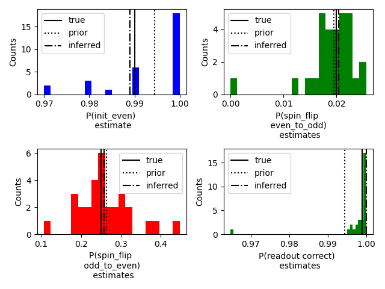
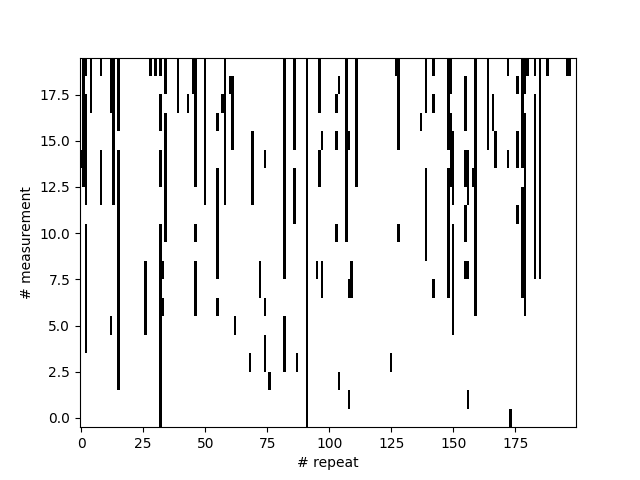

# Diraq-Ares: Predicting Error Causation

Main script: https://github.com/oxquantum-repo/diraq-ares-predicting-error-causation/blob/main/main.py
## Summary

## Quick start

### Installation

1. Clone the repo 

2. In your terminal or anaconda prompt, create an environment and activate it, for example using anaconda

```bash
conda create --name error-causation

conda activate error-causation
```

3. `cd` into the cloned repo directory `diraq-ares-predicting-error-causation/`

4. Install the required packages using pip

```bash
conda install pip

pip install -r requirements.txt
```

### Run

To run the script run and test the model on simulated data, `cd` into the cloned repo directory `diraq-ares-predicting-error-causation/` and run...

```bash
python simulated_error_bars.py
```

...in your terminal or ipython prompt/interactive development environment of choice. There will plots generated. A walk through of what the script is doing can be found in the [source code](https://github.com/oxquantum-repo/diraq-ares-predicting-error-causation/blob/main/main.py), or simplified version in the README.md [here](#mainpy-walkthrough)

To see how the model performance on real data,  `cd` into the cloned repo directory `diraq-ares-predicting-error-causation/` and run...

```bash
python data_handler.py
```

...in your terminal or ipython prompt/interactive development environment of choice. There will plots generated. The source code of the `data_handler.py` script can be found [here](https://github.com/oxquantum-repo/diraq-ares-predicting-error-causation/blob/main/data_handler.py).

## Mission Statement

### Problem


- Repeated PSB non-demolition readout (Two states: Even/Odd == (up, up; down, down)/(up, down; down, up)
- We try to initialise into the even state
- In Experiment Number 1  we measured: even, even, even, odd, odd

#### Questions to answer:

- What caused the change from even to odd in Experiment Number 1 for example?
- Was there a spin flip caused by the non-demolition measurement (back action)?
- Was there a readout error at iterations 4 and 5, i.e. the state was even, be we mistakenly read it as odd twice?
- Could the state have been initialised as odd instead of even, and we read it out incorrectly for the first 3 iterations as even?

### Objectives

- Given a sequence of readout data, predict the probability (with uncertainty) of:
    - A readout error
    - spin flip
    - Initialisation error
- Therefore tell me what happened in this measurement based on these probabilities
- Infer the initialisation state (with uncertainty) based on readout data
- Predict the next state to be read out (with uncertainty) based on previous states

### Solution

- Treat the readout sequences as Markovian
- Use a Hidden Markov Model to extract the system probabilities
- Demonstrate success of Hidden Markov Model on simulated data 

## Results

### Simulated Data


#### Model Performance



### Real Data



#### Model Performance


```bash
P_init: 0.990
P_spin_flip_even_to_odd: 0.016
P_spin_flip_odd_to_even: 0.048
P_readout: 0.935
```

## Discussion

In the ideal case we can do many measurements such that we can gain enough statistics in a given sequence to accurately extract the probability of a spin flip (odd --> even). However, if the T1 time is short we are unable to obtain enough information to reliably predict the spin flip probability as these events appear to be rare.


## `main.py` Walkthrough

hmmlearn.hmm import CategoricalHMM source code: https://github.com/hmmlearn/hmmlearn/blob/38e34ca7739a1691c6bdd3f4db40cf437b353baf/lib/hmmlearn/hmm.py#L524

The flow of the `main.py` script can be outlined in the following steps:

1. Generate simulated data
2. Generate Priors
3. Fit Hidden Markov Model to Simulated Data


### Generating simulated data

First we generate some simulated data using the CategoricalHMM model class. This includes defining the starting probabilities (initialisation), the transition matrix (spin-flip probabilities) and the emission matrix (readout probabilities). This simulated data is plotted [here](#simulated-data)

```python
P_init_even = 0.99  # the probability of initialising in the even state
P_spin_flip_even_to_odd = 0.02  # the probability of back-action flipping the state from even to odd
P_spin_flip_odd_to_even = 0.25  # the probability of back-action flipping the state from odd to even
P_readout = 0.999  # the probability of correctly reading out the state

gen_model = hmm.CategoricalHMM(n_components=2)  # a hidden markov model (hmm) with 2 components

# the probability of initialising in the two states [even, odd]
gen_model.startprob_ = np.array([P_init_even, 1 - P_init_even])

# the transition matrix [[even-even, even-odd], [odd-even, odd-odd]]
gen_model.transmat_ = np.array([
    [1 - P_spin_flip_even_to_odd, P_spin_flip_even_to_odd],
    [P_spin_flip_odd_to_even, 1 - P_spin_flip_odd_to_even]
])

# the emission matrix encoding the readout fidelities
# [[readout even when even, readout even when odd],
# [readout odd when even, readout odd when odd]]
gen_model.emissionprob_ = np.array([
    [P_readout, 1 - P_readout],
    [1 - P_readout, P_readout]
])

# %%  using the generative model to create some data
measured_states = []  # array to hold the measured states (even or odd), this data is available
true_states = []  # array to hold the true states (even or odd), this data is hidden

repeats = 1000  # how many initialisation, measurement, measurement, ... sequences to perform
measurements = 20 # how many measurements in the above sequence.

# generating the data
for i in range(repeats):
	measured_state, true_state = gen_model.sample(measurements)
	
	# appending the data to the arrays
	measured_states.append(measured_state)
	true_states.append(true_state.squeeze())
```

### Create heuristic priors for the parameters

The probability the first measurement is even is:

```
P(first measurement even) = P(init even) P(measure even | even) + P(init odd) P(measure even | odd)
```

And if the initialisation and readout fidelities are good then:

```
P(init even) P(measure even | even) >> P(init odd) P(measure even | odd)
P(first measurement even) approx_eq P(init even) P(measure even | even)
```

We can assume:

```
P(init even) = P(measure even | even) 
```

and therefore:

```
P(first measurement even) = P(init even)^2 = P(measure even | even)^2
```
In the code:

```python
P_first_measurement_even = 1 - measured_states[:, 0].mean()
P_init_even_prior = np.sqrt(P_first_measurement_even)
P_readout_prior = np.sqrt(P_first_measurement_even)
```

The probability of measuring even consecutively for N measurements from initialisation is approximately (neglecting readout errors):

```
P(no transitions) = P(init even) * (1 - P(even to odd))^N
P(even to odd) = 1 - (P(no transitions) / P(init even)) ^ (1 / N)
```

In the code:

```python
P_no_transitions = np.all(measured_states == 0, axis=1).mean()
P_spin_flip_even_to_odd_prior = 1 - (P_no_transitions / P_init_even_prior) ** (1 / measurements)
```

If one considers a transition matrix of the form
```
[[1 - P_eo, P_eo],
[P_oe, 1 - P_oe]]
```

The stead state is `[P_oe, P_eo] / (P_eo + P_oe)`. So the ratio of the occurrence of the even and odd state is `P_oe / P_eo`. So the probability a measurement is odd in the stead-state 

```
P_odd_ss = P_eo / (P_eo + P_oe)
P_oe = (1 / P_odd_ss - 1) * P_eo
```

**We assume that the statistics of the last measurement of each sequence is in the stead state**


```python
P_last_measurement_odd = measured_states[:, -1].mean()
P_spin_flip_odd_to_even_prior = P_spin_flip_even_to_odd_prior * ((1 / P_last_measurement_odd) - 1)
```


### Fit hidden markov models to the data

In principle there could be a lot of data, which would be computationally expensive to fit to. We randomly select a subset of the data to fit to. The variable `sequences_in_subset = 100` sets how many initialisation and measurement sequences are included in the subset. For each of these subsets we fit a hidden markov model (`number_of_models_to_fit = 30`) with a random initialisation informed by our priors. 


```python
sequences_in_subset = 100
number_of_models_to_fit = 30

# an array to inform the fit about the shape of the data, aka how many measurements are in each sequence
subset_shapes = np.full(shape=sequences_in_subset, fill_value=measurements)
full_shapes = np.full(shape=repeats, fill_value=measurements)

models = []
for _ in tqdm(range(number_of_models_to_fit)):
	# creating the hidden markov model
	model = hmm.CategoricalHMM(n_components=2, init_params='')
	model.n_features = 2
	
	# setting the initial parameters of our hmm model somewhat randomly according to our priors on the parameters
	model.startprob_ = np.random.dirichlet([P_init_even_prior, 1 - P_init_even_prior])
	model.transmat_ = np.array([np.random.dirichlet([1 - P_spin_flip_even_to_odd_prior, P_spin_flip_even_to_odd_prior]),
								np.random.dirichlet(
									[P_spin_flip_odd_to_even_prior, 1 - P_spin_flip_odd_to_even_prior])])
	
	model.emissionprob_ = np.array([np.random.dirichlet([P_readout_prior, 1 - P_readout_prior]),
									np.random.dirichlet([1 - P_readout_prior, P_readout_prior])])
	
	# creating the random subset of the data
	random_subset_indices = np.random.choice(repeats, sequences_in_subset)
	random_subset = measured_states[random_subset_indices, ...].reshape(-1, 1)
	
	# fitting the model to the subset of the data
	model.fit(random_subset, subset_shapes)
	
	# storing the score of the fitted model, evaluated over the whole dataset
	model.score = model.score(measured_states.reshape(-1, 1), full_shapes)
	models.append(model)
```

We select the model that scores the best and fit it on the entire dataset to as a double check. We see variation between the models due to the random initialisation which results in the optimiser converging on different locations as well as the randomness of the subset of data selected to fit.


```python
# extracting the fit parameters and associated score for each of the fitted models
start_prob = np.array([model.startprob_ for model in models])
transmat = np.array([model.transmat_ for model in models])
emisprob = np.array([model.emissionprob_ for model in models])
scores = np.array([model.score for model in models])

# finding the model which fits the data best
best_model = models[np.argmax(scores)]
# fitting the model to the complete dataset just incase it changes the minimum slightly
best_model.fit(measured_states.reshape(-1, 1), full_shapes)

# taking the parameters out of matrix form
P_init_even_estimates = start_prob[:, 0]
P_spin_flip_even_to_odd_estimates = transmat[:, 0, 1]
P_spin_flip_odd_to_even_estimates = transmat[:, 1, 0]
P_readout_estimate = (emisprob[:, 0, 0] + emisprob[:, 1, 1]) / 2

```


